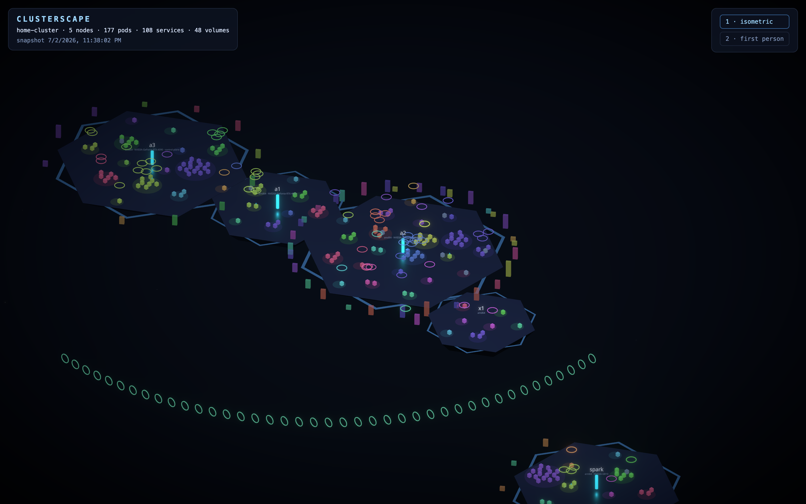

# clusterscape



A 3D explorer for the home cluster. Machines are floating islands, pods are
luminous crystals, services are rings that beam to their pods, ingresses are
portals on a gateway rail, and volumes are slabs docked to the machine that
physically holds the bytes. Hover for X-ray vision, click to read everything
the snapshot knows, hop the relationship graph, or drop into first-person and
walk around your infrastructure.

Built with Next.js + react-three-fiber. Fully static — the deployed page is a
sanitized point-in-time snapshot; the same scene runs live against a bridge
later (see [PLAN.md](PLAN.md)).

## Run it

```sh
npm install
npm run snapshot   # capture from current kubeconfig → public/data/cluster.json
npm run dev        # http://localhost:3000
```

Controls: `1` isometric · `2` first-person (WASD, E/Q up/down, shift run,
click to lock pointer) · hover = tooltip · click = detail panel.

## Deploy (GitHub Pages)

Push to a GitHub repo with Pages set to "GitHub Actions". The workflow builds
the static export with the committed snapshot. Regenerate + commit
`public/data/cluster.json` whenever you want the public diorama refreshed.

## Safety

Snapshots are committed to a public repo, so `scripts/snapshot.mjs` never
reads Secrets/ConfigMaps, drops container env entirely, allowlists
annotations, and redacts tailnet hostnames / keys as a final pass. Read it
before trusting it — it's short.
